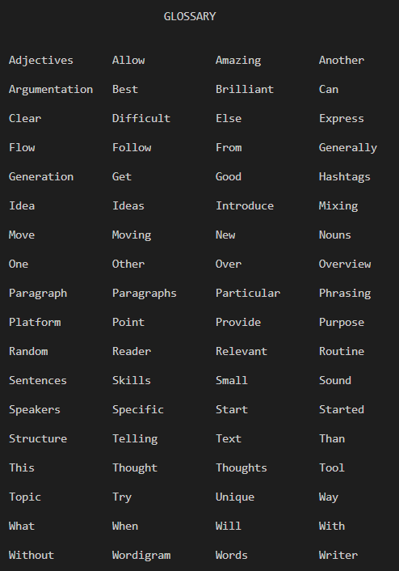

# Glossary Maker

This script generates a glossary of unique words from a given paragraph. It helps identify the distinct words used in the text by removing common words such as articles, prepositions, and conjunctions.

## Getting Started

### Prerequisites
- Python 3.x

### Installation
1. Clone the repository or download the script.
2. Make sure you have Python installed on your system.

### Usage
1. Modify the `paragraph.txt` file to include your desired paragraph or text.
2. Run the script `glossary_maker.py`.
3. The script will generate a glossary of unique words extracted from the paragraph.
4. The glossary will be displayed in the console, showing the words in a formatted manner.

## Example

